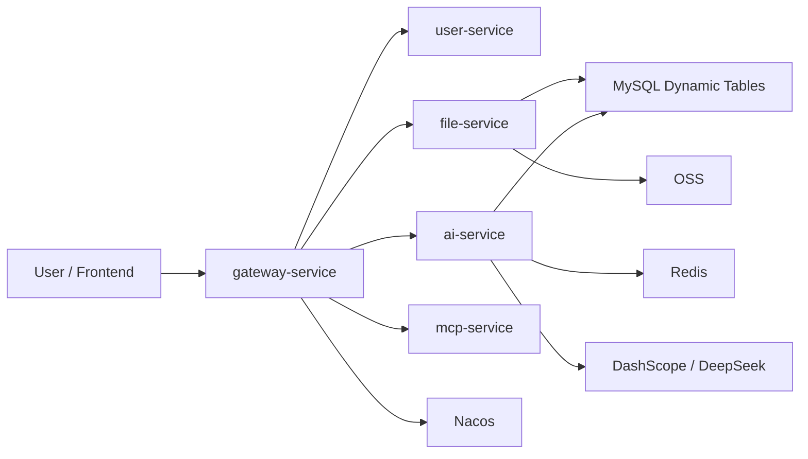

# AI-form-assistant

一个面向 Excel 数据处理的 AI 后端项目。

它的核心目标不是“泛聊天”，而是把用户上传的 Excel 转成结构化数据，再通过大模型帮助用户完成：

- 自然语言查询
- 数据修改
- 图表分析
- 文件导出
- MCP 工具化调用

如果你第一次打开这个仓库，先记住一句话就够了：

**这是一个把 Excel 变成数据库表，再让 AI 帮你操作这些表的微服务系统。**

## 项目一图看懂



## 核心能力

- `user-service`
  - 注册、登录、验证码、用户信息
- `file-service`
  - Excel 上传、预览、下载、恢复、删除
  - Excel 转 MySQL 动态表
- `ai-service`
  - 自然语言查询/修改/图表
  - SQL 生成与执行
  - 文件级 RAG 检索增强
- `gateway-service`
  - 统一入口、跨域、路由和网关令牌校验
- `mcp-service`
  - 把系统能力暴露成 MCP 风格工具
- `common-service`
  - 通用基础设施能力

## 典型业务流程

### 1. 文件导入链路

1. 用户上传 Excel
2. `file-service` 校验文件并上传到 OSS
3. 写入 `files` 元数据
4. 将 Excel 拆成一个或多个 MySQL 动态表
5. 写入 `file_table_mappings` 和 `field_mappings`
6. 返回 `fileId`，供后续 AI 请求使用

### 2. AI 查询链路

1. 用户携带 `fileId` 发起 `/ai/chat/stream`
2. `ai-service` 校验权限并读取表结构
3. 构建或复用文件级 RAG 上下文
4. 判断意图：查询 / 修改 / 图表
5. 选择目标表并生成 SQL
6. 执行 SQL 并通过 SSE 返回过程和结果

## 为什么这个项目值得这样设计

这个项目没有让模型直接“读取 Excel 然后自由发挥”，而是走了一条更稳的路径：

1. 先把 Excel 转成数据库表
2. 再让模型生成 SQL 去操作这些表

这样有几个明显好处：

- 查询结果可验证
- 修改动作更可控
- 支持恢复、导出、分页和图表
- 后续更容易做审计和治理

## 文档入口

如果你想快速上手，建议按这个顺序看：

1. [docs/project-design.md](./docs/project-design.md)
   - 项目总设计说明，适合建立全局认知
2. [docs/rag-integration-guide.md](./docs/rag-integration-guide.md)
   - RAG 接入设计与流程说明
3. [docs/openspec-adoption.md](./docs/openspec-adoption.md)
   - OpenSpec 需求变更闸门和当前 `sales-rag` 变更说明
4. [docs/README.md](./docs/README.md)
   - 文档目录

## 仓库结构

```text
AI-form-assistant/
├─ common-service/
├─ gateway-service/
├─ user-service/
├─ file-service/
├─ ai-service/
├─ mcp-service/
├─ deploy/
├─ docs/
├─ openspec/
├─ init.sql
└─ pom.xml
```

## 本地启动前你需要准备什么

项目依赖：

- MySQL
- Redis
- Nacos
- OSS
- DashScope 或 DeepSeek

当前仓库中的敏感配置已经改成环境变量占位，所以启动前至少要补这些变量：

- `MYSQL_PASSWORD`
- `REDIS_PASSWORD`
- `NACOS_PASSWORD`
- `MAIL_USERNAME`
- `MAIL_PASSWORD`
- `DASHSCOPE_API_KEY`
- `DEEPSEEK_API_KEY`
- `OSS_ACCESS_KEY_ID`
- `OSS_ACCESS_KEY_SECRET`
- `GATEWAY_INTERNAL_TOKEN`

如果使用 `deploy/` 下的容器编排，还需要补：

- `MYSQL_ROOT_PASSWORD`
- `MYSQL_SERVICE_PASSWORD`
- `NACOS_TOKEN_SECRET_KEY`
- `NACOS_AUTH_IDENTITY_KEY`
- `NACOS_AUTH_IDENTITY_VALUE`

## 当前仓库边界

这份仓库当前重点是后端服务和部署配置。

所以如果你在这里没看到完整的前端主工程，这不是遗漏，而是当前仓库本身就偏后端交付。

## 维护建议

如果你接下来准备继续完善这个项目，比较推荐的顺序是：

1. 先读 `docs/project-design.md`
2. 本地把基础依赖起起来
3. 先跑通“上传 Excel -> AI 查询”主链路
4. 再看 `ai-service` 里的 RAG 和 SQL 生成逻辑

这样上手会顺很多，也不容易一开始就陷进细节里。
