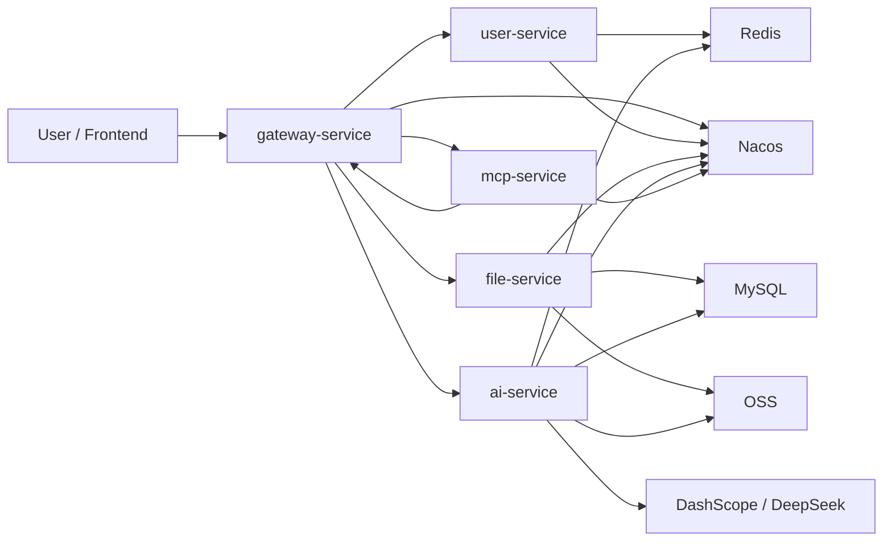
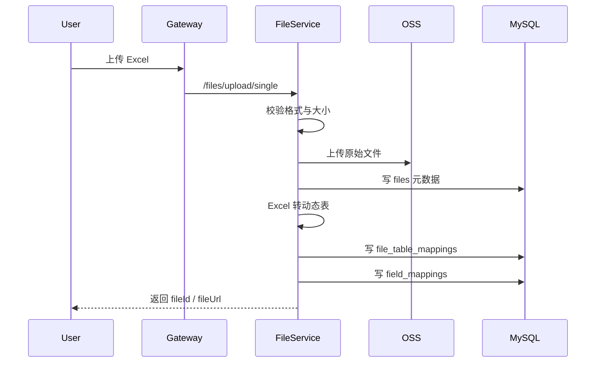
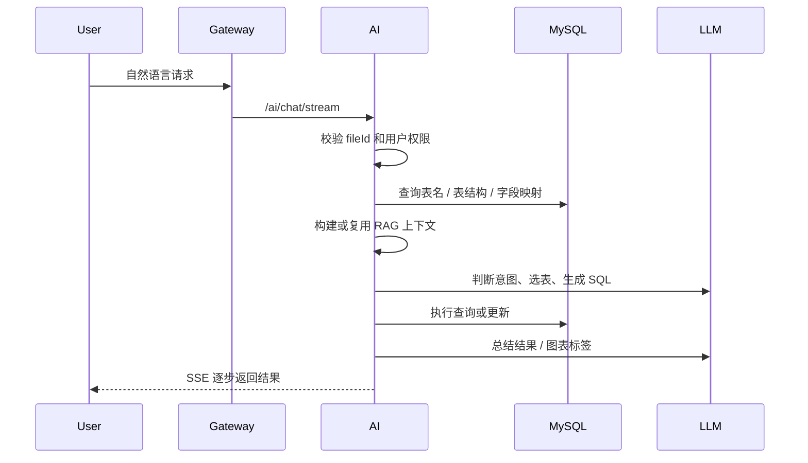

# AI-form-assistant 项目设计说明

## 1. 先说结论

这个仓库当前的主体不是一个“通用 AI 助手”，而是一个 **面向 Excel 数据处理的 Spring Cloud 微服务后端**。

它解决的问题可以概括成一句话：

**把用户上传的 Excel 文件转成可查询的结构化数据，再让大模型帮用户用自然语言去查询、修改、分析和可视化这些数据。**

如果你是第一次接手这个项目，建议先建立下面这条主线：

1. 用户登录
2. 上传 Excel
3. Excel 被拆成 MySQL 动态表
4. 用户发起自然语言请求
5. AI 服务理解意图并生成 SQL
6. SQL 落到动态表上执行
7. 结果通过 SSE、图表或导出文件返回

## 2. 项目定位

### 仓库名和代码名为什么不完全一样

- GitHub 仓库名：`AI-form-assistant`
- Maven 聚合工程名：`chat2Excel`

这说明项目在对外命名和内部实现上还没有完全统一。

理解时以代码实际能力为准：当前核心能力是 **Chat to Excel**。

### 这个项目更像什么

它更像下面这个组合：

- 文件管理平台
- Excel 结构化转换器
- 面向 Excel 的 AI SQL 助手
- 图表生成入口
- 一个可暴露工具能力的 MCP 服务

而不是传统的“知识库问答系统”或“表单填报系统”。

## 3. 整体架构

### 核心依赖角色

- `Nacos`
  - 服务注册与配置中心
- `MySQL`
  - 业务元数据、AI 请求记录、Excel 转换后的动态表
- `Redis`
  - 登录态、验证码、网关令牌校验等缓存
- `OSS`
  - 原始文件与导出文件存储
- `DashScope / DeepSeek`
  - 大模型能力

## 4. 模块职责

### `gateway-service`

这是统一入口层。

它主要做三件事：

1. 路由转发
2. 跨域处理
3. 网关令牌校验

从配置上看，当前暴露给前端的主要路由有：

- `/api/v1/users/**`
- `/api/v1/files/**`
- `/api/v1/llm/**`
- `/api/v1/ai/**`

### `user-service`

这是认证和账户模块。

主要能力：

- 邮箱验证码发送
- 注册/登录统一入口
- 查询用户信息
- 修改密码
- 登出

它的重点不是复杂权限系统，而是先把“一个用户能安全地管理自己的 Excel 文件”这件事跑通。

### `file-service`

这是项目的数据入口，也是最关键的基础模块之一。

它负责：

1. 上传 Excel 到 OSS
2. 在 `files` 表记录文件元数据
3. 将 Excel 转换为 MySQL 动态表
4. 记录 Sheet 与表的映射
5. 记录数据库字段与原始表头的映射
6. 提供预览、下载、恢复、删除能力

一句话说，它把“非结构化的 Excel 文件”变成了“后续 AI 能操作的结构化数据源”。

### `ai-service`

这是业务中枢。

它不直接存 Excel，而是基于 `file-service` 产出的动态表继续做：

- 意图识别
- 目标表选择
- SQL 生成
- SQL 执行
- 图表数据准备
- 修改后 Excel 导出
- AI 历史记录保存
- RAG 检索增强

这个模块是“自然语言 -> 可执行数据操作”的核心桥梁。

### `mcp-service`

这是对外工具层。

它把系统能力包装为可被外部调用的 MCP 风格工具，目前重点是：

- 用户认证
- 文件列表
- AI 对话能力

它更偏“能力开放接口”，方便未来接第三方 Agent 或外部工具平台。

### `common-service`

这是公共基建层，主要沉淀：

- `Result` 统一响应
- JWT 工具
- Redis / OSS / Email 服务
- 网关令牌过滤器
- 全局异常处理
- 日志切面

它的作用是把通用能力从业务模块里抽出来，减少重复实现。

## 5. 数据模型怎么理解

这个项目最关键的不是某张固定业务表，而是这几类“元数据 + 动态表”的组合。

### 固定元数据表

- `files`
  - 文件本身的信息
- `file_table_mappings`
  - 一个文件里的 Sheet 映射到哪些数据库表
- `field_mappings`
  - 动态表字段和 Excel 原始表头的映射关系
- `ai_requests`
  - 用户发起过哪些 AI 请求、结果怎样

### 动态业务表

上传的每个 Excel 会被拆成一个或多个动态 MySQL 表。

这意味着：

- 项目不是围绕“预定义业务 schema”设计的
- 而是围绕“把 Excel 变成临时可操作数据表”设计的

这也是为什么 `field_mappings` 很重要：

它决定了 AI 看到的数据库字段，最后怎样映射回用户真正认识的中文表头。

## 6. 两条最重要的业务链路

## 6.1 文件导入链路

这个链路的关键节点在于：

- 原始文件保存在 OSS
- 后续 AI 不直接操作 Excel 文件本体
- 而是操作转换后的 MySQL 动态表

这让查询和修改都变成了标准 SQL 问题。

## 6.2 AI 查询/修改链路

这条链路的核心不是“直接问大模型拿答案”，而是：

**让大模型参与理解问题和生成 SQL，最终仍然以数据库执行结果为准。**

这让系统更可控，也更适合业务数据场景。

## 7. RAG 在系统里的位置

现在 RAG 已经接入到了 `ai-service`。

但它不是传统意义上的“外部知识库 RAG”，而是：

**面向当前 Excel 文件的文件级 RAG。**

### 它检索的是什么

- 文件名
- Sheet 和表映射
- 字段映射关系
- 表结构
- 样例数据片段

### 它的作用是什么

- 辅助判断用户说的是哪张表
- 辅助理解字段含义和中文表头
- 提升 SQL 生成准确度
- 提升多 Sheet 场景下的命中率

### 它不是什么

- 不是企业知识库
- 不是外部文档检索系统
- 不是长期持久化的向量库

当前版本使用的是 **内存缓存索引 + DashScope Embedding**，重点是先让文件内上下文可检索。

如果你想看更细的 RAG 设计，可以继续看：

- [docs/rag-integration-guide.md](/D:/Proejct_improvement/AI-form-assistant-remote/docs/rag-integration-guide.md:1)

## 8. 为什么这个设计是合理的

这个项目最聪明的一点，是没有让 AI 直接“读 Excel 然后随便回答”，而是做了两层降维：

1. 先把 Excel 转成数据库
2. 再让 AI 生成 SQL 去操作数据库

这样带来的价值很实际：

- 查询结果可验证
- 修改动作可控
- 后续能支持分页、恢复、导出
- 图表生成也能建立在结构化数据之上

换句话说，AI 在这里是“理解器 + SQL 生成器”，不是“结果真相源”。

## 9. 当前项目的边界和短板

如果你要接手维护，这一节很重要。

### 1. 当前仓库主要是后端

这里已经有后端服务和部署配置，但前端主工程并不在当前仓库主体里。

所以如果有人问“为什么我没看到完整页面工程”，这不是他看漏了，而是当前仓库本身就偏后端。

### 2. 动态表设计带来灵活性，也带来治理成本

优点：

- 任意 Excel 都能导入

代价：

- 表数量可能增长很快
- 动态表清理、命名规范、长期维护都需要额外治理

### 3. AI 结果仍受 Prompt 与模型波动影响

虽然最终会走 SQL 执行，但以下环节仍然受模型质量影响：

- 意图识别
- 目标表选择
- SQL 生成
- 图表标签命名

所以系统的稳定性并不只取决于 Java 代码，还取决于模型与 Prompt 设计。

### 4. 目前更像单租户/轻量 SaaS 形态

当前设计已经有用户隔离，但距离复杂企业级多租户能力还有差距，例如：

- 更细粒度的数据权限
- 更成熟的审计
- 更完整的资源隔离

## 10. 新人建议怎么读代码

如果你要快速熟悉项目，建议按下面顺序看：

1. 根 `pom.xml`
   - 先搞清模块边界
2. `gateway-service`
   - 先看整个系统怎么对外暴露接口
3. `user-service`
   - 理解登录态怎么建立
4. `file-service`
   - 理解 Excel 是怎么被转成动态表的
5. `ai-service`
   - 理解自然语言是怎么被翻译成 SQL 的
6. `docs/rag-integration-guide.md`
   - 理解最新加入的 RAG 能力
7. `deploy/docker-compose-mid.yml`
   - 理解本地一套环境怎么起

## 11. 本地启动时需要先知道什么

从仓库内容看，项目依赖这些基础设施：

- MySQL
- Redis
- Nacos
- OSS
- DashScope 或 DeepSeek

当前配置已经改成了环境变量占位，所以要启动成功，至少要补这些值：

- `MYSQL_PASSWORD`
- `REDIS_PASSWORD`
- `NACOS_PASSWORD`
- `MAIL_USERNAME`
- `MAIL_PASSWORD`
- `DASHSCOPE_API_KEY`
- `DEEPSEEK_API_KEY`
- `OSS_ACCESS_KEY_ID`
- `OSS_ACCESS_KEY_SECRET`
- `GATEWAY_INTERNAL_TOKEN`

如果走容器部署，还需要补：

- `MYSQL_ROOT_PASSWORD`
- `MYSQL_SERVICE_PASSWORD`
- `NACOS_TOKEN_SECRET_KEY`
- `NACOS_AUTH_IDENTITY_KEY`
- `NACOS_AUTH_IDENTITY_VALUE`

## 12. 一句话理解每个模块的协作关系

可以把整个系统理解成下面这句：

**`user-service` 负责“谁在用”，`file-service` 负责“数据从哪来”，`ai-service` 负责“怎么理解并操作数据”，`gateway-service` 负责“怎么对外暴露”，`mcp-service` 负责“怎么把能力开放出去”，`common-service` 负责“所有模块共用的底座”。**

## 13. 最后给维护者的建议

如果后面我们继续演进这个项目，优先级比较高的方向会是：

1. 补完整 README 和启动指南
2. 给动态表命名、清理、恢复建立更清晰的治理策略
3. 为 AI 关键链路补回归测试
4. 把 Prompt、模型配置、RAG 配置进一步标准化
5. 明确前端工程与当前后端仓库的边界

这样别人接手时，不需要先“猜项目是什么”，而是能马上进入开发状态。
