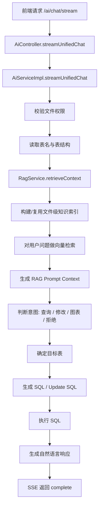

# Chat2Excel RAG 接入说明

## 1. 这次改了什么

这次不是单纯“在 Prompt 前面多拼几句文本”，而是给 `ai-service` 加了一条完整的 RAG 链路：

1. 从当前 Excel 对应的元数据里抽取知识
2. 把知识切成可检索片段
3. 对片段做向量化
4. 结合用户问题检索相关片段
5. 把检索结果注入到原有 AI 流程
6. 继续走原来的分类、选表、生成 SQL、执行 SQL、返回结果

当前版本的基线已经升级为 **DashScope Embedding + PostgreSQL pgvector 持久化向量索引**。也就是说，RAG 不再只依赖 Java 内存对象，而是把当前文件的向量 chunk 写入 `rag_vector_chunks`，后续同一个文件再次提问时会优先复用 pgvector 中已有索引。

## 2. 为什么这样接

这个项目本质上是“对上传 Excel 进行自然语言查询/修改/制图”。

所以最有价值的知识库，不是外部百科，而是当前文件本身的：

- 文件名
- Sheet 和表名映射
- 字段映射关系
- 表结构
- 表里的样例数据

也就是说，这次接入的是一个 **面向当前 Excel 文件的文件级 RAG**。

这样做的好处是：

- 能更准地判断用户到底在问哪张表
- 能更准地理解中文表头和数据库字段的对应关系
- 生成 SQL 时更贴近真实数据
- 在多 sheet 场景下，选表错误率会明显下降

## 3. 新增/修改的核心文件

### 新增

- `ai-service/src/main/java/com/bitejiuyeke/ai/config/RagProperties.java`
  - RAG 配置项
- `ai-service/src/main/java/com/bitejiuyeke/ai/dto/rag/RagContext.java`
  - 检索结果上下文对象
- `ai-service/src/main/java/com/bitejiuyeke/ai/service/RagService.java`
  - RAG 服务接口
- `ai-service/src/main/java/com/bitejiuyeke/ai/service/impl/RagServiceImpl.java`
  - RAG 核心实现

### 修改

- `ai-service/src/main/java/com/bitejiuyeke/ai/service/AiModelService.java`
  - 给大模型调用接口增加 `ragContext`
- `ai-service/src/main/java/com/bitejiuyeke/ai/service/impl/AiModelServiceImpl.java`
  - 在字段提取、SQL 生成、自然语言回复时注入 RAG 上下文
- `ai-service/src/main/java/com/bitejiuyeke/ai/service/impl/AiServiceImpl.java`
  - 主流程里接入“构建索引 -> 检索上下文 -> 注入提示词”
- `ai-service/src/main/java/com/bitejiuyeke/ai/config/ProcessStage.java`
  - 新增 `BUILD_RAG_INDEX`、`RETRIEVE_RAG_CONTEXT`
- `ai-service/src/main/resources/bootstrap.yml`
  - 补充 embedding 和 RAG 配置

## 4. 请求进来后的完整流程

下面是现在一次 `/ai/chat/stream` 请求的实际处理链路。



## 5. RAG 内部每一步到底做了什么

### 第 1 步：拿到当前文件的知识源

`RagServiceImpl` 会根据 `fileId` 读取：

- `files`
- `file_table_mappings`
- `field_mappings`
- 当前动态表里的样例数据

样例数据不是全表扫描，而是按配置做 `limit` 采样。

### 第 2 步：把知识整理成片段

当前会构造三类片段：

1. `file_summary`
   - 文件名、文件 ID、sheet 数量、sheet 和表映射
2. `table_schema`
   - sheet 名、表名、总行数、原始表头、字段映射
3. `table_samples`
   - 每张表的样例数据片段

示例上，`table_schema` 片段大致是这种内容：

```text
文件名：销售统计.xlsx
Sheet名称：一季度销售
数据库表：sales_q1
总行数：128
原始表头：地区, 销售员, 产品, 销售额
字段映射：col_1->地区, col_2->销售员, col_3->产品, col_4->销售额
```

### 第 3 步：向量化

使用 `EmbeddingModel` 对这些片段做向量化。

当前配置是：

- 模型来源：DashScope Embedding
- 默认 embedding 模型：`text-embedding-v3`

### 第 4 步：持久化并复用 pgvector 索引

为了避免每次聊天都重新做 embedding，`RagServiceImpl` 会先检查 pgvector 中是否已经存在当前 `fileId` 的 chunk：

- 如果不存在，就从文件元数据、表结构、字段映射、销售术语和样例数据构建 chunk，并写入 `rag_vector_chunks`
- 如果已经存在，就复用 pgvector 中的已有索引
- 如果文件数据被 AI 修改，更新流程会调用 `RagService.invalidate(fileId)` 删除旧 chunk，下次提问时重新构建

也就是说，同一个文件连续问多次时，通常会直接复用索引。

### 第 5 步：检索

收到用户问题后：

1. 先对用户问题做一次向量化
2. 按 `fileId` 从 pgvector 检索候选 chunk
3. 结合向量相似度、销售关键词、归一化业务词、时间摘要和表上下文做 Java 侧重排
4. 聚合出候选表排序
5. 取 TopK 结果并拼成 `promptContext`

### 第 6 步：把 RAG 注入原有 AI 链路

这一步是最关键的。

当前 RAG 检索结果会被注入到以下环节：

1. 意图判断
   - 判断是查询、修改、生成图表还是拒绝
2. 字段提取
   - 从用户问题中抽取列名/指标名
3. 目标表选择
   - 多 sheet 时优先参考 RAG 命中的表名
4. SQL 生成
   - 查询 SQL
   - 修改 SQL
5. 自然语言结果总结
   - 不再返回空 `aiResponse`

## 6. 现在 SSE 会多出哪些阶段

为了让前端能看到更完整的过程，这次新增了两个处理阶段：

- `BUILD_RAG_INDEX`
- `RETRIEVE_RAG_CONTEXT`

所以现在的阶段顺序大致是：

1. `INIT`
2. `VALIDATE_FILE`
3. `GET_TABLE_NAMES`
4. `GET_TABLE_STRUCTURE`
5. `BUILD_RAG_INDEX`
6. `RETRIEVE_RAG_CONTEXT`
7. `ANALYZE_INPUT`
8. `PROCESS_CHAT`
9. `QUERY_SQL` 或 `UPDATE_SQL`
10. `EXECUTE_QUERY_SQL` 或 `EXECUTE_UPDATE_SQL`
11. `AI_RESPONSE`
12. `COMPLETE`

## 7. 关键代码逻辑说明

### 7.1 `RagServiceImpl.retrieveContext(...)`

这是 RAG 入口，做三件事：

1. 检查是否启用 RAG、是否存在 embedding 模型
2. 构建或复用当前文件的知识索引
3. 返回 `RagContext`

`RagContext` 里包括：

- 是否启用
- 是否命中缓存
- 总片段数
- 命中片段数
- 命中的表名列表
- 表级排序结果
- 给前端展示的检索摘要
- 给 Prompt 使用的上下文文本

### 7.2 `AiServiceImpl.prepareRagContextAndSendProgress(...)`

这个方法把 RAG 真正塞进主流程，并且把过程通过 SSE 返回给前端。

它会发送两类进度消息：

- 索引是新构建还是复用缓存
- 本次检索命中了多少片段、涉及哪些表

现在这两个 SSE 阶段还会带结构化 `metadata`，方便前端或调试工具读取：

- `BUILD_RAG_INDEX`
  - `ragEnabled`
  - `indexAction`：`BUILT`、`REUSED` 或 `SKIPPED`
  - `indexedChunkCount`
  - `fallbackReason`
- `RETRIEVE_RAG_CONTEXT`
  - `matchedChunkCount`
  - `matchedTableNames`
  - `rankedTables`
  - `fallbackReason`

这些 metadata 不包含完整 Prompt 上下文，也不直接暴露样例行内容，避免调试信息泄露业务数据。

### 7.3 `AiServiceImpl.determineTargetTable(...)`

以前是：

- 提取字段
- 根据字段去映射表

现在变成：

1. 如果只有一张表，直接返回
2. 如果 RAG 已命中明确表名，优先用 RAG 结果
3. 如果 RAG 没命中，再走字段提取回退逻辑

这一步能明显改善多 sheet 场景。

### 7.4 `AiModelServiceImpl`

这里做了两类增强：

1. Prompt 统一增加 `ragContext`
2. 输出结果增加清洗

包括：

- 去掉 SQL 代码块包裹
- 去掉反引号
- 字段提取支持 `,`、`，`、换行等多种分隔

## 8. 配置项说明

### Embedding 配置

在 `bootstrap.yml` 里补充了：

```yml
spring:
  ai:
    dashscope:
      api-key: ${spring.ai.alibaba.dashscope.api-key}
      embedding:
        enabled: true
        options:
          model: text-embedding-v3
```

说明：

- 这里复用了现有 DashScope key
- Chat 模型和 Embedding 模型现在都能从 `spring.ai.dashscope` 下读取

### RAG 自定义配置

```yml
chat2excel:
  rag:
    enabled: true
    top-k: 4
    similarity-threshold: 0.45
    sample-rows-per-table: 15
    rows-per-chunk: 5
    cache-minutes: 30
```

含义：

- `enabled`
  - 是否开启 RAG
- `top-k`
  - 每次最多返回几个命中片段
- `similarity-threshold`
  - 相似度阈值
- `sample-rows-per-table`
  - 每张表最多采多少行做知识片段
- `rows-per-chunk`
  - 每个样例片段放多少行
- `cache-minutes`
  - 索引缓存时长

## 9. 这一版 RAG 的边界

当前版本已经从早期“内存索引第一版”演进为“pgvector 持久化召回 + Java 销售语义重排”的版本。

但它也有明确边界：

1. 样例数据是采样，不是全量入库
   - 更适合“理解表和字段”，不是做全文搜索
2. 目前没有接独立 rerank 模型
   - 当前是 pgvector 召回后，在 Java 侧做销售术语、时间字段和表级排序增强
3. 当前以文件级重建为主
   - 修改数据后会删除该文件全部 chunk，下次查询再重建，而不是做行级增量更新
4. 这不是企业知识库
   - 它主要服务当前 Excel 文件的查询、修改、分析和图表生成

## 10. 建议你接下来怎么验证

### 10.1 先测多 sheet 场景

准备一个包含 2~3 个 sheet 的 Excel，例如：

- 学生成绩
- 教师信息
- 课程安排

然后问这种问题：

- “帮我查一下数学成绩大于 90 的学生”
- “把三年级二班的英语成绩都加 5 分”
- “帮我画一下各班平均分柱状图”

观察点：

- SSE 里是否出现 `BUILD_RAG_INDEX` 和 `RETRIEVE_RAG_CONTEXT`
- 命中的表是否合理
- 最终 SQL 是否落到正确表上

### 10.2 再测字段同名/近义词场景

例如表头写的是：

- `销售额`
- `成交金额`
- `GMV`

然后问：

- “查一下各地区销售金额”

看 RAG 是否能借助样例和字段映射把语义对齐。

### 10.3 再测连续多轮同文件提问

连续问同一个文件几次，观察 `BUILD_RAG_INDEX` 阶段是否变成“复用RAG索引”，并检查 SSE `metadata.indexAction` 是否从 `BUILT` 变成 `REUSED`。

### 10.4 验证修改后索引失效

对同一个销售文件先问一次查询问题，让系统构建索引；再执行一次修改类问题，例如：

- “把华东区 5 月销售额修正为 10000”

观察点：

- 修改流程执行后服务日志应出现 `pgvector索引已失效`
- 下一次对同一文件提问时，`BUILD_RAG_INDEX` 应重新显示构建索引
- pgvector 表里的该 `fileId` chunk 会先被删除，再重新写入

## 11. 本次本地校验情况

由于当前环境没有 `mvn`，我没有办法直接跑完整 Maven 构建。

但我已经做了两步静态校验：

1. 对本次修改过的 Java 文件做了一次局部 `javac` 编译检查
2. 修复了检查中暴露出来的真实签名问题后再次通过

所以这次提交至少在语法和主要类型引用上是通的。

## 12. 一句话总结

这次接入后的主链路已经变成：

**先从当前 Excel 构建文件级知识库，再检索出和问题最相关的表结构/字段/样例数据，把这些上下文注入到原有 Chat2Excel 的分类、选表、SQL 生成和结果总结流程中。**
